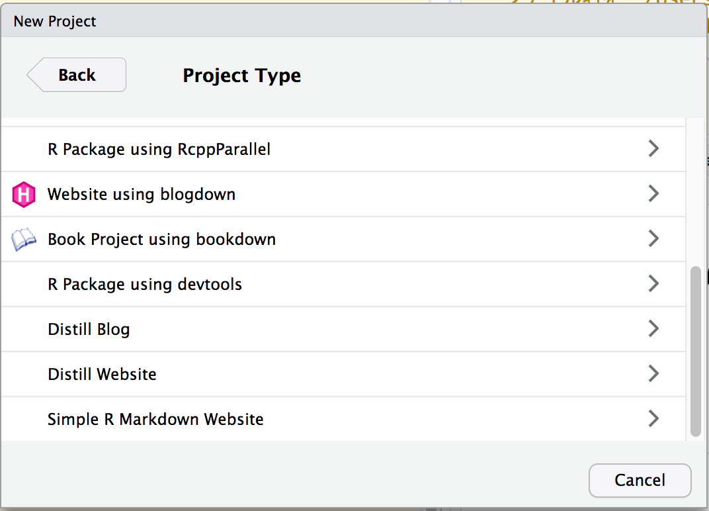

```{r setup, include=FALSE}
knitr::opts_chunk$set(echo = TRUE, eval = FALSE)
# library(klippy)
```

```{r klippy, echo=FALSE, include=TRUE}
# klippy::klippy()
```

## distill パッケージについて

distillパッケージは、Rstudio社が提供する?Rパッケージになります。
このパッケージは、Rを使ってBlogやWebサイトを構築できる便利なパッケージです。
このBlog記事も、distillパッケージを使ってBlog記事を書いています。

## なぜdistillパッケージを使うか?

RでBlogやWebサイトを構築するパッケージには、blogdownパッケージやrmarkdownパッケージがありますが、blogdownはhugoとか使わないといけないし、rmarkdownだと、素っ気ない感じがしてました(cssとか設定がめんどい...)。

なんでdistillパッケージで書いている記事を見つけた時は、hugoとかもいらないし、rmakdownと違ってスマートな装飾がいいじゃん!!!ってなりました。

なので、結構お気に入りのパッケージなんですが、公式のサイトしか説明がない...

ということで、最初のBlog記事ということもあり、簡単にdistill パッケージで、
記事を作成する方法について書こうと思います。

## Blogの作り方

まず、Rにdistillパッケージが入っていないと動かないのでインストールする

```{r, eval=FALSE}
install.packages("distill")
library(distill)
```

次に、サイトを作るのに必要なファイルを作ってくれる`distill::create_blog()`をRのコンソールに入力する。

```{r, eval=FALSE}
create_blog(
  dir = "Blogのディレクトリを作る場所",
  title = "blogのタイトル"
)
```

これで、Blogのために必要なファイルが作成される。

Rstudioを使っているのであれば、以下の画像のようにGUIの操作でBlogを作成することができる(楽チン)。



すると以下の図のようなファイルができあがる

```{r, eval = TRUE, width = 50, echo=FALSE}
# All defaults
knitr::include_graphics(path = "images/figure2.png")
```


そして、以下のコマンド

```{r, eval=FALSE}
rmarkdown::render_site(encoding = 'UTF-8')
```

か、Rstuioを使っている人なら、`ctrl + shift + B(windows)`、もしくは
`command + shift + B(Mac)`を入力するとBlogができる!!!
詳しくは、君たちの目で確かめてね!(時間がある時に更新します...)

# 記事の作り方

記事の作り方も簡単で以下のコマンドを打てば、`_post/`の下に記事のファイルが作られる。

```{r, eval=FALSE}
distill::create_post(
  title = "記事のタイトル",
  author = "作成者",
  draft =  FALSE, # 下書きかどうかを決める引数 TRUE = 下書き, FALSE = 下書きにしない
)
```

## 終わりに

自分のためのdistillなので、詳しくは、distillパッケージの[本家サイト](https://rstudio.github.io/distill/)を見た方が早いです...

他にも、サイトの構成をいじるTipsがあるのですが、また今度じっくりやります。

それでは、また...
