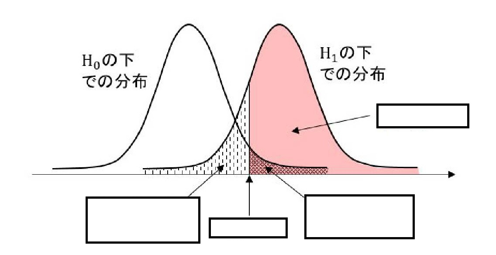
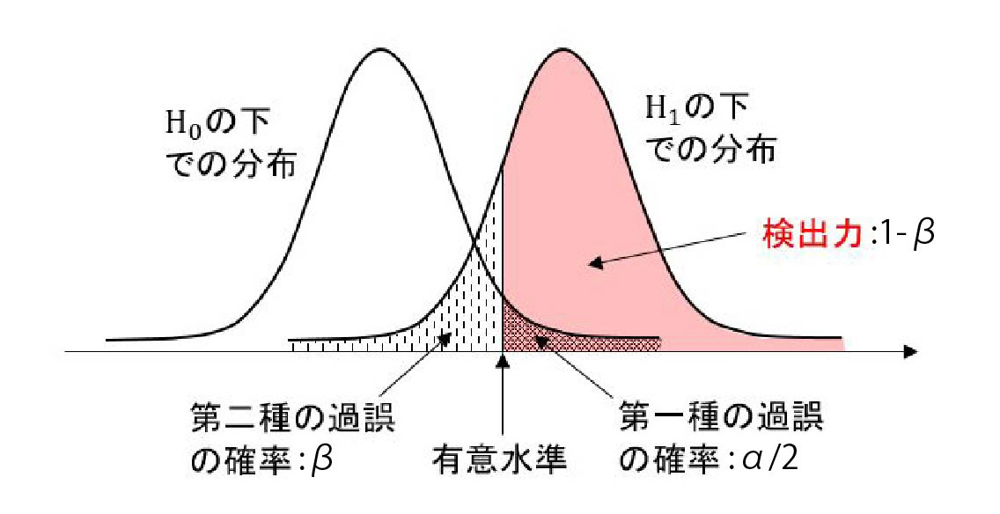
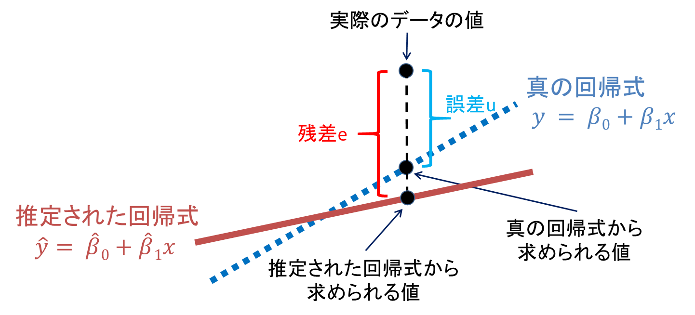

```{r setup, include=FALSE}
options(htmltools.dir.version = FALSE)
knitr::opts_chunk$set(
  fig.width = 9, fig.height = 3.5, fig.retina = 3,
  fig.align = "center",
  out.width = "100%",
  cache = FALSE,
  echo = FALSE,
  message = FALSE, 
  warning = FALSE,
  hiline = TRUE
)
```

```{r xaringanExtra setting, echo=FALSE}
xaringanExtra::use_tile_view()
xaringanExtra::use_panelset()
xaringanExtra::use_progress_bar(color = "#0051BA", location = "bottom")
xaringanExtra::use_webcam()
# xaringanExtra::use_clipboard()
# htmltools::tagList(
#   xaringanExtra::use_clipboard(
#     button_text = "<i class=\"fa fa-clipboard\"></i>",
#     success_text = "<i class=\"fa fa-check\" style=\"color: #90BE6D\"></i>",
#     error_text = "<i class=\"fa fa-times-circle\" style=\"color: #F94144\"></i>"
#   ),
#   rmarkdown::html_dependency_font_awesome()
# )
```

```{r xaringanthemer setting, include=FALSE}
library(xaringanthemer)

# create xarignan-themer.css
style_mono_accent(
  base_color = "#0052a4",
  text_font_family = "YuGothic",
  header_font_family = "YuGothic",
  text_bold_color = "#FF0066",
  text_font_size = "24px"
)

# create custom.css
extra_css <- list(
  ".small" = list("font-size" = "15px"),
  ".xsmall" = list("font-size" = "70%"),
  ".scroll-box-12" = list("height" = "12em", "overflow-y" = "scroll"),
  ".scroll-box-14" = list("height" = "14em", "overflow-y" = "scroll"),
  ".scroll-box-16" = list("height" = "16em", "overflow-y" = "scroll"),
  ".scroll-box-18" = list("height" = "18em", "overflow-y" = "scroll"),
  ".scroll-box-20" = list("height" = "20em", "overflow-y" = "scroll"),
  ".scroll-output" = list("height" = "90%", "overflow-y" = "scroll"),
  ".left-col" = list(
    "width" = "29%",
  "text-align" = "left",
  "padding-left" = "20px",
  "padding-right" = "20px",
  "float" = "left"
),
  ".center-col" = list(
  "width" = "29%",
  "text-align" = "left",
  "padding-left" = "20px",
  "padding-right" = "20px",
  "float" = "left"
),

".right-col" = list(
  "width" = "29%",
  "text-align" = "left",
  "padding-left" = "20px",
  "padding-right" = "20px",
  "float" = "left"
))

# write `custom_css`
xaringanthemer::style_extra_css(
  css = extra_css,
  outfile = "./extra.css", append = FALSE
  )
```

```{r, echo=FALSE}
library(tidyverse)
```


# 目次

### [1変数, 2変数の記述統計の分野](#chap1)
### [データ収集, 確率, 分布の分野](#chap2)
### [推定，検定, 線形モデルの分野](#chap3)

---
name: chap1
class: middle center

# 1変数, 2変数の記述統計

---
Q. ジニ係数とは何か答えろ

--

(0, 0) と (1, 1)を結ぶ線分 (完全平等線) とローレンツ曲線で囲まれた部分の面積の2倍の値

--

Q. 分散 $S^2_x$ の公式を答えろ

--

$$S_x^2=\frac{1}{n} \sum_{i=1}^n\left(x_i-\bar{x}\right)^2=\frac{\left(x_1-\bar{x}\right)^2+\left(x_2-\bar{x}\right)^2+\cdots+\left(x_n-\bar{x}\right)^2}{n}$$

--

Q. データの平均 $\bar{x}^2$ を用いて、分散を求める公式を答えろ

--

$$S_x^2=\frac{1}{n} \sum_{i=1}^n(x_i^2-\bar{x}^2)$$

---

Q. データの変動係数 $CV$ の公式を答えろ

標準偏差 $S_x$ と 平均 $\bar{x}$ を用いること

--

$$CV = \frac{\bar{x}}{S_x}$$

- 単位の異なるデータのばらつきや、平均値に対するデータとばらつきの関係を相対的に評価する際に用いる単位を持たない（＝無次元の）数値です。

--

Q. データ $x_i$ の標準化得点 $z_i$ の公式を、データ $x_i$ , 平均( $\bar{x}$ ), 標準偏差 $S_x$ を用いて答えろ

--

$$ z_i = \frac{x_i - \bar{x}}{S_x} $$

--

Q. 偏差値 の公式を答えろ

--

$$ \frac{x_i - \bar{x}}{S_x} \times 10 + 50$$

---

Q. データ $(x_i, y_i)$ の共分散 $S_{xy}$ を答えろ <sup>*</sup>

--

$$S_{xy} = \frac{1}{n}\sum^{n}_{i=1}(x_i-\bar{x})(y_i-\bar{y})$$

--
Q. $x_i, y_i$ の平均同士の掛け合わせの数値( $\bar{x} \cdot \bar{y}$ )を用いて、共分散を求める式を答えろ

--

$$S_{xy} = \frac{1}{n}\sum^{n}_{i=1}(x_iy_i - \bar{x} \cdot \bar{y})$$

---
Q. 分布が以下のような場合の時、歪度はどのような値をとるか答えろ

- データの分布が **右** に裾が長いとき
- データの分布が **左** に裾が長いとき
- 左右対称

---

Q. 分布が以下のような場合の時、歪度はどのような値をとるか答えろ

- データの分布が **右** に裾が長いとき: 歪度は正の値
- データの分布が **左** に裾が長いとき: 歪度は負の値
- 左右対称: 0になる

--

Q. 正規分布の尖度の値は、いくつか答えろ

--

- 正規分布の尖度は、0 (3の場合もあるがほぼ使わない)
- 尖度が大きいほど、分布の山が尖っている

---

Q. 3項移動平均の式を答えろ

--

$$ \frac{1月 + 2月 + 3月}{3}$$

--


Q. 4項移動平均の式を答えろ

--

$$ \frac{1月 \times 0.5 + 2月 + 3月 + 4月 + 5月 \times 0.5}{4}$$

---

Q. 変化率を答えろ

--

$$ \frac{比較時 - 基準時}{基準時} \times 100$$

--

Q. 以下のことから、平均変化率の公式を求めろ

- 基準となる時期の値が $a$
- その $n$ 期後の比較対象の時期の値が $b$
- このとき、次の式を満たす $r$ or $100 \space r$ を平均変化率を答えろ

--

$$ a \times (1+r)^n = b$$

---

Q. 以下の表を用いて、ラスパイレス指数とパーシェ指数を答えろ<sup>*</sup>

|        | 財X      |          | 財Y      |          |
|--------|----------|----------|----------|----------|
|        | 購入数量 | 平均価格 | 購入数量 | 平均価格 |
| 基準年 | $Q_X$    | $P_X$    | $Q_Y$    | $P_Y$    |
| 比較年 | $Q'_X$   | $P'_X$   | $Q'_Y$   | $P'_Y$   |

--

.pull-left[
- ラスパイレス指数: **基準年の購入量**や取引量等を重みとして算出した価格指数のこと

$$\frac{P_X^{\prime} Q_X+P_Y^{\prime} Q_Y}{P_X Q_X+P_Y Q_Y} \times 100$$
]
.pull-right[

- パーシェ指数: **比較年の購入量**や取引量等を重みとして算出した価格指数のこと

$$\frac{P_X^{\prime} Q_X^{\prime}+P_Y^{\prime} Q_Y^{\prime}}{P_X Q_X^{\prime}+P_Y Q_Y^{\prime}} \times 100$$
]

---
name: chap2
class: middle center
# データ収集, 確率, 分布の分野


---
Q. フィッシャーの3 原則について答えろ

- 繰り返し(反復):
- 無作為化:
- 局所管理:

---
Q. フィッシャーの3 原則について答えろ

- 繰り返し(反復): 同じ処理を何度も行う
- 無作為化: 処理をランダムに割り付ける
- 局所管理: ブロック（狭い範囲）内で均一な条件を実現する
- <a href="https://bellcurve.jp/statistics/course/12744.html" target="_blank" rel="noopener noreferrer">フィッシャーの3原則</a>

---
Q. 以下の事柄について答えろ

- 試行:
- 事象:
- 排反:

---
Q. 以下の事柄について答えろ

- 試行: 確率的な実験（例）サイコロを投げる
- 事象: 確率的に起きた事がら（例）１の目が出る
- 排反: 一方の事象が起これば，もう一方の事象は起こらない関係のこと

--

Q. 排反事象が成り立つ場合、事象 $P(A)$ と事象 $P(B)$ を用いてどのような公式が導けるか

--

事象Aと事象Bが互いに排反であるときには次の式が成り立ちます<sup>1</sup>。

.footnote[<sup>1</sup><a href="https://kou.benesse.co.jp/nigate/math/a14m0513.html" target="_blank" rel="noopener noreferrer">参考サイト</a>]

$$P(A \cup B) = P(A) + P(B)$$

--

Q. 事象 $P(A)$ と事象 $P(B)$ が独立である場合、どのような公式が導けるか答えろ

--

$$P(A \cap B) = P(A)P(B)$$


---
Q. 条件付き確率 $P(A|B)$ の公式を答えろ

--

事象 $B$ が起きたという条件のもとでの事象 $A$ の起きる確率であり、次の式で求めます。

$$P(A|B) =\frac{P(A \cap B)}{P(B)}$$

--

Q. ベイズの定理の公式( $P(B_k|A)$ )を答えろ

--

$$P(B_k|A) = \frac{P(A|B_k) \times P(B_k)}{\sum^n_{i=1}P(A|B_k) \times P(B_k)}$$

--

Q. 累積分布関数 $F$ を $P$ を使って表せ

--

$$F(x) = P(X \leq x)$$

---
Q. 確率変数 $X, Y$ の期待値( $E(X), E(Y)$ )を用いて、 $E(X+Y)$ について解け

--

$$E(X+Y) = E(X) + E(Y)$$

--

Q. $E(aX+b)$ の式を展開すると、どうなるか答えろ

--

$$E(aX+b) = aE(X) + b$$

--

Q. 確率変数 $X$ と $Y$ が独立ならば、期待値 $E(XY)$ についてどのような公式が成り立つか

--

$$E(XY) = E(X)E(Y)$$

--

Q. 離散型の確率変数の分散を求める式を2つ答えろ(うち一つは $p_i$ を用いて答えろ)<sup>*2</sup>

--

$$ V(X) = E[(X - E(X))^2]$$
$$ V(X) = \sum^n_{i=1}p_i(x_i - E(X))^2$$
.footnote[<sup>2</sup><a href="https://bellcurve.jp/statistics/course/6716.html" target="_blank" rel="noopener noreferrer">参考サイト</a>]

---
Q. 分散の式 $V(aX+b)$ を展開しろ

--

$$V(aX+b) = a^2V(X)$$

--

Q. 確率変数 $X$ と $Y$ が独立ならば、分散 $V(X+Y)$ はどのように展開できるか

--

$$V(X+Y) = V(X) + V(Y)$$

--

Q. $\{E(X)\}^2$, $E(X^2)$ を用いて確率変数 $X$ の分散 $V(X)$ を答えろ

--

$$V(X) = E(X^2) - \{E(X)\}^2$$

--

Q. 共分散 $Cov(X,Y)$ の算出式を、 $E(XY), E(X), E(Y)$ を使って示せ<sup>*</sup>

--

$$Cov(X,Y) = E(XY) - E(X)E(Y)$$
--

Q. この時、確率変数 $X$ と $Y$ が独立ならば共分散はどのような数値になるか

--

A. 0

---
Q. 共分散の一般化した式 $V(X \pm Y)$ を答えろ<sup>*</sup>

--

$$V(X \pm Y) = V(X) \pm 2Cov(X,Y) + V(Y)$$

--

Q. 確率変数の組 $(X, Y)$ を次のように $(S, T)$ におきかえる一次変換がある場合の、共分散 $Cov(S, T)$ を答えろ<sup>*</sup>

--

A. $Cov(S, T) = acCov(X,Y)$

--

Q. またこの時の、相関係数の値 $\rho(X,Y)$ の正負を答えろ

--

$ac>0$ ならば $\rho(X,Y)$

$ac<0$ ならば $-\rho(X,Y)$

---
Q. 連続型確率変数の式を答えろ

\begin{align}
  &P(a\leq X \leq b)\\
  &E(X)\\
  &V(X)\\
  &F(x)
\end{align}

---
Q. 連続型確率変数の式を答えろ

\begin{align}
  &P(a\leq X \leq b) = \int_{a}^{b}f(x)dx\\
  &E(X) = \int^{\infty}_{-^\infty}xf(x)dx\\
  &V(X) = \int^{\infty}_{-^\infty}(x-E(X))^2f(x)dx\\
  &F(x) = P(X \leq x)
\end{align}

---
Q. 連続型一様分布の確率密度関数と期待値を求めろ

\begin{equation}
f(x)=
\end{equation}

$$E(X)$$

---
Q. 一様分布の確率密度関数と期待値を求めろ

\begin{equation}
f(x)=\left\{\begin{array}{l}
0(x<a) \\
\frac{1}{b-a}(a \leq x \leq b) \\
0(x>b)
\end{array}\right.
\end{equation}

$$E(X) = \frac{a+b}{2}$$

---
Q. ベルヌーイ分布の期待値、分散を確率は $p$ を用いて答えろ

$E(X)$

$V(X)$

---
Q. ベルヌーイ分布の期待値、分散を確率は $p$ を用いて答えろ

$E(X)=p$

$V(X)=p(1-p)$

---
Q. 二項分布の確率密度関数・期待値・分散を答えろ(確率は $p$ , サンプルサイズは $n$ とする)<sup>*</sup>

$P(X=x)$

$E(X)$

$V(X)$

---
Q. 二項分布の確率密度関数・期待値・分散を答えろ(確率は $p$ , サンプルサイズは $n$ とする)<sup>*</sup>

$P(X=x)=\frac{n!}{x!(n-x)!}p^x(1-p)^{n-x} = {}_{n}C_{x}p^x(1-p)^{n-x}$

$E(X)=np$

$V(X)=np(1-p)$

$n$ が大きい場合は、正規分布で近似が可能

$$B(n,p) ~ N(np, np(1-p))$$

---
Q. ポアソン分布の確率密度関数を答えろ

$P(X=x)$

$E(X)$

$V(X)$

---
Q. ポアソン分布の確率密度関数を答えろ

$P(X=x)=\frac{e^{-\lambda} \cdot \lambda^x}{x!}(x=0,1,\cdots)$

$E(X)=\lambda$

$V(X)=\lambda$

- ポアソン分布は、 $\lambda$ が大きくなるにつれて正規分布に近づく( $n$ が10くらいでも正規分布<sup>3</sup>

.footnote[<sup>3<sup><a href="https://www.hello-statisticians.com/toukei-kentei-2-kakomon-cat/201611-2.html" target="_blank" rel="noopener noreferrer">参考サイト</a>]

---
Q. 幾何分布の確率密度関数・期待値・分散を答えろ (確率を $p$ とする)<sup>*</sup>

$P(X=x)$

$E(X)$

$V(X)$

---
Q. 幾何分布の確率密度関数・期待値・分散を答えろ (確率を $p$ とする)<sup>*</sup>

$P(X=x)=p(1-p)^{x-1}(x=1,2,\cdots)$

$E(X)=\frac{1}{p}$

$V(X)=\frac{1-p}{p^2}$

---
name: chap3
class: middle center

# 推定，検定, 線形モデルの分野

---
標本平均を $\bar{X}$ , 母分散 $\sigma^2$ , 不偏分散を $U^2$ , サンプルサイズ $n$ を用いて、以下の問いに答えろ

--

Q. 母平均の推定(母分散**既知**の場合)の信頼度95% を求める公式を答えろ

--

$$\bar{X}-1.96 \times \frac{\sigma}{\sqrt{n}} \leq \mu \leq \bar{X}+1.96 \times \frac{\sigma}{\sqrt{n}}$$

--
Q. 母平均の推定(母分散**未知**, 小標本場合)を求める公式を答えろ

--

$$\bar{X}-t_{0.025}(n-1) \times \frac{U}{\sqrt{n}} \leq \mu \leq \bar{X}+t_{0.025}(n-1) \times \frac{U}{\sqrt{n}}$$

--
Q. 母平均の推定(母分散**未知**, 大標本の場合)を求める公式を答えろ

--

$$\bar{X}- 1.96 \times \frac{U}{\sqrt{n}} \leq \mu \leq \bar{X}+1.96 \times \frac{U}{\sqrt{n}}$$

---
標本平均を $\bar{X}$, 不偏分散を $U^2$ , サンプルサイズ $n$ を用いて、以下の問いに答えろ

Q. 母分散 $\sigma^2$ の推定(母平均未知)を求める公式を答えろ<sup>*</sup>

--

$$\frac{(n-1)U^2}{\chi^2_{0.025}(n-1)} \leq \sigma^2 \leq \frac{(n-1)U^2}{\chi^2_{0.975}(n-1)}$$

---
Q. 母比率 $p$ の推定（大標本）を求める公式を答えろ (標本比率は $\hat{p}$ とする)

--

$$\hat{p}-1.96 \times \sqrt{\frac{\hat{p}(1-\hat{p})}{n}} \leq p \leq \hat{p}+1.96 \times \sqrt{\frac{\hat{p}(1-\hat{p})}{n}}$$

--

Q. 信頼区間の幅を $x$ 以下にする場合に必要なサンプルサイズの計算の公式を答えろ

--

$$ 2 \times z_{\frac{1-\alpha}{2}} \times \sqrt{\frac{\hat{p}(1-\hat{p})}{n}} \leq \frac{x}{100}$$

- 「信頼区間の幅が** $\pm x$ %以下**となるために必要なサンプルサイズ」の場合、  
  もしくは、「標本誤差を** $x$ %以内**にするために必要なサンプルサイズ」を求める場合<sup>\*</sup>

$$z_{\frac{1-\alpha}{2}} \times \sqrt{\frac{\hat{p}(1-\hat{p})}{n}} \leq \frac{x}{100}$$

.footnote[<sup>*</sup> 「2×」の部分は不要, <a href="https://bellcurve.jp/statistics/course/9129.html" target="_blank" rel="noopener noreferrer">参考サイト</a>]

---
Q. 以下の表を埋めろ

```{r}
library(kableExtra)
library(readr)
library(tidyr)
library(here)
tbls_qes <- readr::read_csv(file = here::here("data/tbls1_qes.csv"),
                            na = "NA",
                            col_types = cols(...1 = col_character(),
                                             ...2 = col_character(),
                                             ...3 = col_character(),
                                             ...4 = col_character()))

tbls_qes %>% 
  tidyr::replace_na(replace = list("...1" = "", "...2" = "", "...3" = "", "...4" = "")) %>% 
  kableExtra::kbl(col.names = c("", "", "帰無仮説が正しい", "対立仮説が正しい"),
                  escape = FALSE, format = "html") %>% 
  kableExtra::kable_styling() %>% 
  kableExtra::kable_paper(full_width = F) %>% 
  kableExtra::add_header_above(c(" " = 2, "真実" = 2)) %>%
  kableExtra::collapse_rows(columns = 1, valign = "top")
```

- 第一種の過誤: 
- 第二種の過誤: 
- 検出力:
- P値:

---
Q. 以下の表を埋めろ

```{r}
library(dplyr)
library(kableExtra)
library(readr)
library(here)
tbls_ans <- readr::read_csv(file = here::here("data/tbls1_ans.csv"), na = "NA")

tbls_ans %>% 
  kableExtra::kbl(col.names = c("", "", "帰無仮説が正しい", "対立仮説が正しい"),
                  escape = FALSE, format = "html") %>% 
  kableExtra::kable_styling() %>% 
  kableExtra::kable_paper(full_width = F) %>% 
  kableExtra::add_header_above(c(" " = 2, "真実" = 2))
```

- 第一種の過誤: 帰無仮説が正しいとき，正しいはずの帰無仮説を棄却してしまう誤り
- 第二種の過誤: 対立仮説が正しいとき，正しくないはずの帰無仮説を受容してしまう誤り
- 検出力: 対立仮説が正しいとき，帰無仮説を棄却できる確率
- P値: 検定統計量の値よりも極端な値をとる確率

.footnote[<a href="https://bellcurve.jp/statistics/course/9315.html" target="_blank" rel="noopener noreferrer">参考サイト</a>]

---
Q. 以下の画像の空白部分を埋めろ



.footnote[[出典元サイト](https://a-m-zyozo.hatenablog.com/entry/2020/09/10/132204)]

---
Q. 以下の画像の空白部分を埋めろ



.footnote[[出典元サイト](https://a-m-zyozo.hatenablog.com/entry/2020/09/10/132204)]

---
Q. 母平均の仮説検定の検定統計量を答えろ

--

$$Z = \frac{\bar{X} - \mu}{\sigma / \sqrt{n}}$$

--

Q. 母平均の仮説検定（母分散未知，小標本）の場合の検定統計量を答えろ

--

$$t = \frac{\bar{X} - \mu}{U / \sqrt{n}}$$

--

Q. 母平均の仮説検定（母分散未知，大標本）の場合の検定統計量を答えろ

--

$$Z = \frac{\bar{X} - \mu}{U / \sqrt{n}}$$

---
Q. 母比率の検定（大標本）の場合  
  母比率が $p$ であるという帰無仮説のもとで，標本の大きさが $n$ のとき，標本比率を $X/n$ とする時の検定統計量を答えろ<sup>*</sup>

--

$$Z=\frac{\frac{X}{n}-p}{\sqrt{\frac{p(1-p)}{n}}}$$


--

Q. この母比率の差の検定（大標本）の場合の  
  ２群の母比率に差がないという帰無仮説のもとで，標本の大きさをそれぞれ $n_1, n_2$, 標本比率をそれぞれ $X_1/n_1, X_2/n_2$ とする時の検定統計量を答えろ

--

$$Z=\frac{\frac{X_1}{n_1}-\frac{X_2}{n_2}}{\sqrt{\left(\frac{1}{n_1}+\frac{1}{n_2}\right) \frac{X_1+X_2}{n_1+n_2}\left(1-\frac{X_1+X_2}{n_1+n_2}\right)}}$$

---
Q. 母平均の差の検定(対応のある２群の場合)  
  大きさ $n$ の対応するデータに対して，母集団が正規分布に従っていて，差の標本平均を $X_{diff}$ , 差の不偏分散を $U^2$ とするときの検定統計量を答えろ。またこの時の自由度も合わせて答えろ

--

$$T=\frac{X_{diff}}{\sqrt{\frac{U^2}{n}}}$$

A. 自由度 $n-1$ の $t$ 分布に従う

--

Q. 母平均の差の検定(対応のない２群で，母分散既知の場合)  
  母集団がそれぞれ正規分布に従っていて，差の標本平均を $X_{diff}$ , 母分散が $σ_1^2，σ_2^2$ , 標本の大きさが $n_1, n_2$ のときの検定統計量を答えろ

--

$$Z=\frac{X_{diff}}{\sqrt{\frac{\sigma^2_1}{n_1} + \frac{\sigma^2_2}{n_2}}}$$


---
Q. 母平均の差の検定(対応のない２群で，母分散未知（大標本）の場合)  
  差の標本平均を $X_{diff}$ , 不偏分散を $U_1^2，U_2^2$ , 標本の大きさを $n_1, n_2$ とするときの検定統計量を答えろ

--

$$Z=\frac{X_{diff}}{\sqrt{\frac{U^2_1}{n_1}+\frac{U^2_2}{n_2}}}$$

--
Q. 母平均の差の検定(対応のない２群で，母分散未知（小標本，等分散）の場合)

母集団がそれぞれ正規分布に従っていて，２つの母分散が等しいとき，標本の大きさをそれぞれ $n_1, n_2$ とするときの検定統計量を答えろ

--

.pull-left[
$$t=\frac{X_{diff}}{\sqrt{U_p^2(\frac{U^2_1}{n_1}+\frac{U^2_2}{n_2})}}$$
]

.pull-right[
$$U_p^2=\frac{\sum_{k=1}^{n_1}\left(X_k-\bar{X}\right)^2+\sum_{k=1}^{n_2}\left(Y_k-\bar{Y}\right)^2}{n_1+n_2-2}$$
]

---
Q. 等分散仮説の検定

２つの正規母集団の無作為標本（標本の大きさはそれぞれ $n_A, n_B$ ）から求められる不偏分散をそれぞれ $U_A^2, U_B^2$ とし，これらが独立であるものとします。２群の母分散が等しいという帰無仮説のもとで，次の検定統計量を答えろ。またその時の自由度も答えろ

--

$$F=\frac{U_A^2}{U_B^2}$$

自由度は、 $F(n_B-1, n_A-1)$ 

---
Q. 適合度検定とは、どのようなときに用いる検定か答えろ。またこの時の、帰無仮説と対立仮説を答えろ

--

A. データの分布が特定の理論にあっていないことを示すための検定

- 帰無仮説：実験結果が仮定した理論に適合する
- 対立仮説：実験結果が仮定した理論に適合しない

--

Q. 観測度数を $X_1, X_2, \cdots, X_k$ , 期待確率を $p_1, p_2, \cdots, p_k$ , 全度数を $n$ とするときの期待度数を求めろ

--

$$ np_1, np_2, \cdots, np_k$$


Q. この時の検定統計量を答えろ。またその時の自由度も答えろ

--

.pull-left[
$$\chi^2 = \sum_{i=1}^k\frac{(X_i-np_i)^2}{np_i}$$
]
.pull-right[
$\chi^2(k-1)$
]

.footnote[<a href="https://bellcurve.jp/statistics/course/9494.html" target="_blank" rel="noopener noreferrer">参考サイト</a>]

---
Q. 独立性の検定は、どのような検定か答えろ。また、この時の帰無仮説と対立仮説を答えろ

--

A. $k$ 行 $l$ 列のクロス集計表において，2つの要因が独立ではないことを示すために用います。

- 帰無仮説：行と列の要因は独立である
- 対立仮説：行と列の要因は独立でない

--

Q. また、この時の期待度数 $p_{ij}$ を求めろ

--

$$p_{ij}=\frac{X_{i.} \times X_{.j}}{n}$$

--
Q. この時の検定統計量と自由度を答えろ

--

.pull-left[
$$\chi^2 = \sum_{i=1}^k \sum_{j=1}^l \frac{\left(x_{ij}-p_{ij}\right)^2}{p_{ij}}$$
]

.pull-right[
- $\chi^2(k-1 \times l-1)$ の上側の片側検定
]


.footnote[<a href="https://bellcurve.jp/statistics/course/9496.html" target="_blank" rel="noopener noreferrer">参考サイト</a>]


---
Q. 分散分析表を完成させろ。また、この時の検定は何側検定か

データ( $x_1, x_2, \dots, x_n$ ), 全体平均( $\bar{x}_t$ ), 群平均( $\bar{x}_g$ )を用いて答えろ

```{r}
library(readr)
library(here)
library(kableExtra)
tbl2_que <- readr::read_csv(file = here::here("data/tbls2_qes.csv"),
                            col_types = cols(A = col_character(),
                                             偏差平方和 = col_character(),
                                             自由度 = col_character(),
                                             分散 = col_character(),
                                             分散比 = col_character()
                                             ), na = "NA")

kableExtra::kbl(tbl2_que, col.names = c("", "偏差平方和(平方和)", "自由度", "分散(平均平方)", "分散比(F値)"), escape = FALSE, format = "html", align = "ccccc") %>% 
  kableExtra::kable_styling() 
```

---
Q. 分散分析表を完成させろ。また、この時の検定は何側検定か

データ( $x_1, x_2, \dots, x_i, \dots, x_n$ ), 全体平均( $\bar{x}_t$ ), 群平均( $\bar{x}_g$ )を用いて答えろ

```{r}
library(readr)
library(here)
library(kableExtra)
tbl2_ans <- readr::read_csv(file = here::here("data/tbls2_ans.csv"),
                            col_types = cols(A = col_character(),
                                             偏差平方和 = col_character(),
                                             自由度 = col_character(),
                                             分散 = col_character(),
                                             分散比 = col_character()
                                             ), na = "NA")

kableExtra::kbl(tbl2_ans, col.names = c("", "偏差平方和(平方和)", "自由度", "分散(平均平方)", "分散比(F値)"), escape = FALSE, format = "html", align = "ccccc") %>% 
  kableExtra::kable_styling() 
```

- 右側検定

.footnote[<a href="https://bellcurve.jp/statistics/course/10059.html" target="_blank" rel="noopener noreferrer">二元配置分散分析</a>]

---
Q. 単回帰分析の回帰係数の検定は、何検定か答えろ。またこの時の帰無仮説・対立仮説を、偏回帰係数 $\beta$ を用いて、答えなさい。

--

- $t$ 検定
- 帰無仮説: $\beta = 0$, 対立仮説: $\beta \neq 0$

Q. この時の検定統計量の自由度は、いくつか答えろ(サンプルサイズ $n$ を用いてよい)

--

自由度: $n - 2$

Q. この時の $t$ 値を、回帰係数 $\beta$ と標準誤差 $se$ を使って求めろ

--

$$ \beta \div se$$

Q. 残差平方和(residual sum of squares, $RSS$ ) を 予測値 $\hat{y_i}$ と 観測値 $y_{i}$ を用いて答えろ

--

- A. $RSS =  \sum^n_{i=1}\epsilon^2_i = \sum^n_{i=1}(\hat{y_i} - y_{i})^2 = \sum^n_{i=1}(\hat{y_i} - (\alpha + \beta x_{i}))^2$
- 残差平方和を自由度の $n-2$ で割ったものが誤差項( $\epsilon$ )の分散の不偏推定量になります。

.footnote[<a href="https://bellcurve.jp/statistics/course/9700.html" target="_blank" rel="noopener noreferrer">単回帰分析</a>]

---
Q. 推定値の平均 $\bar{\hat{y}}$ は何と等しいか答えろ

--

A. 推定値の平均値 $\bar{\hat{y}}$ は、実際の観測値の平均 $\bar{y_{i}}$ と等しい

--

Q. 回帰直線は どこを通るか答えろ

--

A. 回帰直線は $(\bar{x}, \bar{y})$ を通る


---
Q. 重回帰分析の回帰係数の検定は、何検定か答えろ。またこの時の帰無仮説・対立仮説を、偏回帰係数 $\beta_i$ を用いて、答えなさい。

--

- $t$ 検定
- 帰無仮説: $b_i = 0$, 対立仮説: $b \neq 0 \space(i=1,2, \cdots, p)$

Q. この時の回帰係数の検定統計量の自由度は、いくつか答えろ(サンプルサイズ $n$ を用いてよい)

--

自由度: $n - p - 1$

この検定で有意であることが示せると，回帰係数の中に０でないものが１つ以上あることになり，重回帰モデルに意味があることになります。

Q. この時の $t$ 値を、回帰係数 $\beta$ と標準誤差 $se$ を使って求めろ。

--

$$ \beta \div se$$

.footnote[<a href="https://bellcurve.jp/statistics/course/9702.html" target="_blank" rel="noopener noreferrer">重回帰分析</a>]

---
Q. 回帰係数 $\beta$ の信頼区間を 標準誤差 $se (\hat{\beta_i})$ 求めよ

--

$$\widehat{\beta}_i-t_{\frac{\alpha}{2}}(n-k-1) \times s e\left(\widehat{\beta}_i\right) \leq \beta_i \leq \widehat{\beta}_i+t_{\frac{\alpha}{2}}(n-k-1) \times \operatorname{se}\left(\widehat{\beta}_i\right)$$

--

Q. 決定係数とは何か答えろ

--

A. 決定係数はデータに対する、推定された回帰式の当てはまりの良さ（度合い）を表します。決定係数は一般に $R^2$ で示され、0から1までの値をとります。1に近いほど、回帰式が実際のデータに当てはまっていることを表しており、説明変数が目的変数をよく説明していると言えます。

---
Q. 自由度調整済み決定係数は何か答えろ

--

A. 決定係数は説明変数の数が増えるほど1に近づくという性質を持っています。そのため、説明変数の数が多い場合には、この点を補正した「自由度調整済み決定係数（自由度修正済み決定係数）」を使います。自由度調整済み決定係数は次の式から求められます。 $n$ はサンプルサイズを、 $k$ は説明変数の数を表します。

$$R_f^2=1-\frac{\frac{\sum_{i=1}^n\left(y_i-\widehat{y}_i\right)^2}{n-k-1}}{\frac{\sum_{i=1}^n\left(y_i-\bar{y}\right)^2}{n-1}}$$

--

Q. 重相関係数とは何か答えろ

--

A. 実際に観測された目的変数の値と、重回帰式をあてはめて計算した推定値（理論値）との相関係数です。重相関係数は一般に $R$ で示され、0から1の間の値を取ります。1に近いほど分析の精度は高いと言えます。


---
Q. 残差と誤差

```{r, out.width="35%"}

```


Q. 残差の性質を2つ答えろ

--

.pull-left[
- 残差の総和は0である
  $$ \sum e_i = 0$$
]

.pull-right[
- 説明変数と残差の積和は0である（この式は、説明変数と残差との間には相関がない（＝無相関である）ということを表す）
  $$ \sum x_ie_i = 0$$
]

---
Q. 以下の分散分析表を埋めろ

```{r}
library(readr)
library(here)
library(kableExtra)
options(knitr.kable.NA = '')
tbl3_qes <- readr::read_csv(file = here::here("data/tbls3_qes.csv"), na = "NA")
kableExtra::kbl(tbl3_qes, escape = FALSE, format = "html", align = "lcccc") %>% 
  kableExtra::kable_styling()
```

---
Q. 以下の分散分析表を埋めろ

```{r}
library(readr)
library(here)
library(kableExtra)
tbl3_ans <- readr::read_csv(file = here::here("data/tbls3_ans.csv"))
kableExtra::kbl(tbl3_ans,escape = FALSE, format = "html", align = "lcccc") %>% 
  kableExtra::kable_styling() 
```


---
# 参考にしたサイト

- <a href="https://toketarou.com/cheatsheet/" target="_blank" rel="noopener noreferrer">【完全網羅】統計検定２級チートシート</a>
